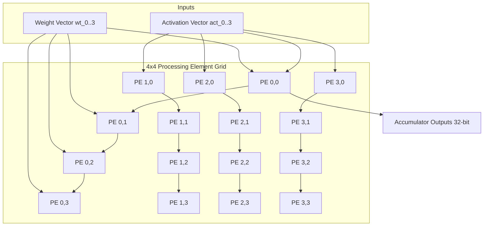

# 36 - Synthesizable 4x4 Systolic Tensor Core Accelerator (Verilog)

## Executive Overview
A fully synthesizable **4x4 INT8 2D mesh systolic array** matrix multiplication accelerator written in **IEEE 1364 Verilog**. It implements pipelined Multiply-Accumulate (MAC) Processing Elements (PEs) with skewed data wavefronts, designed for deep learning inference edge silicon.

## Systolic Array Datapath



### Source Tree
- **`src/processing_element.v`**: Pipelined MAC cell with input registers and 32-bit accumulator.
- **`src/systolic_array_4x4.v`**: Top-level 4x4 array interconnect with generate loops.
- **`src/tb_systolic_array_4x4.v`**: Self-checking simulation testbench dumping VCD waveforms.
- **`Makefile`**: Native build rules for Icarus Verilog (`iverilog`).
- **`runner/run.js`**: Cycle-accurate RTL simulation harness.

## Mathematical Formulation: Systolic Matrix Multiplication
For matrices A and B of size 4x4, the accumulator at PE(i, j) computes:
$$C_{i,j} = \sum_{k=0}^{3} A_{i,k} \cdot B_{k,j}$$

Data enters the array skewed by cycle offsets (step k arrives at PE(i, j) at cycle $t = i + j + k$), achieving $O(N)$ computational latency.

## Native Compilation & Simulation
```bash
make
./systolic_sim.vvp
# View waveforms
gtkwave systolic_array_waves.vcd
```

## Universal Verification
```bash
node runner/run.js
node orchestrator/run.js --project=36-verilog
```

## Senior Interview Q&A
- **Q: Why use systolic arrays over traditional SIMD vector units?** Systolic arrays forward intermediate activations and weights directly to adjacent processing elements via local interconnects, minimizing expensive memory reads from register files or SRAM.
- **Q: How is accumulator overflow avoided in INT8 computation?** While inputs are 8-bit signed integers ($[-128, 127]$), the internal accumulation registers are 32-bit wide, providing 24 bits of headroom to prevent overflow during long matrix contractions.\n